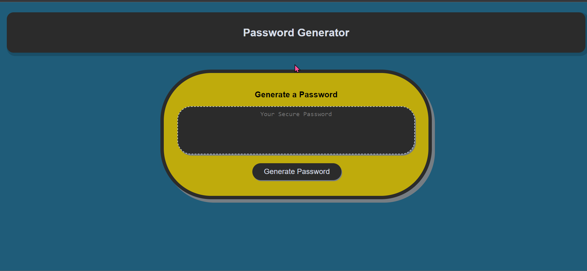

# PasswordGenerator

PassWord Generator is a web application that generates a random and secure password. It provides flexible options for the length and character type.

## Features
- Generate a random and secure password with customizable criteria.
- Choose any length between 8 and 128 characters.
- Include or exclude special characters, uppercase letters, lowercase letters, and numbers.
- Passwords are generated instantly.
- Interface includes only one button for ease of use.

## Technologies Used
- HTML: Builds the structure of the page. Have two separate html files the main page and another for the high scores.
Technologies Used

- CSS: Styles the elements and enhances the visual appearance of the application.

- JavaScript: Implements the logic and functionality of the quiz, including question generation, user input handling, timer management, and score tracking.

## Getting Started
To use the Password Generator, follow these steps:

1. Navigate to the following url: https
2. Click the "Generate Password" button to start the password generation process.
3. Follow the prompts and select the desired length and character types.
4. When the displays, then the user can copy the password.

## License
This project is licensed under the MIT license.

## Acknowledgements

- Used starter code from osu coding boot camp challenge.
## Screenshot
